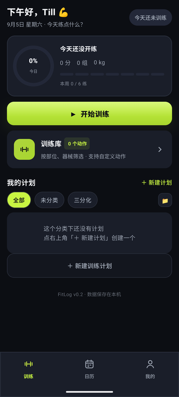
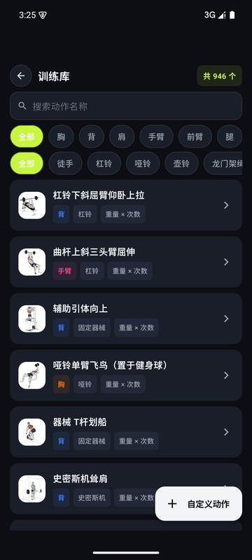
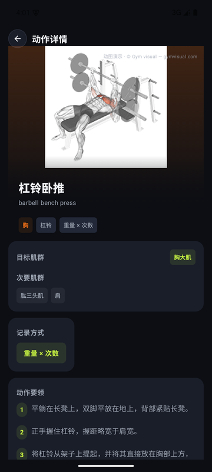
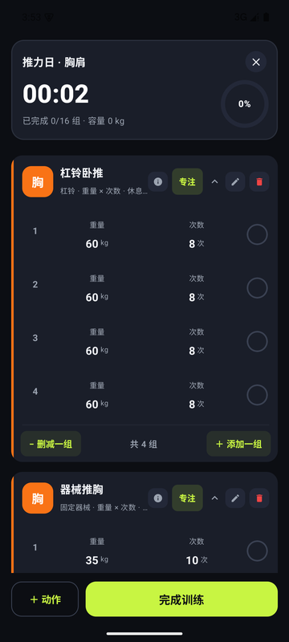
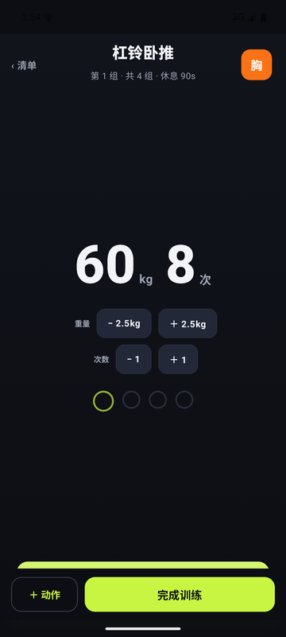
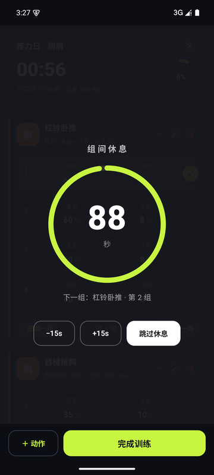
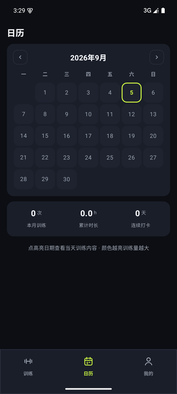
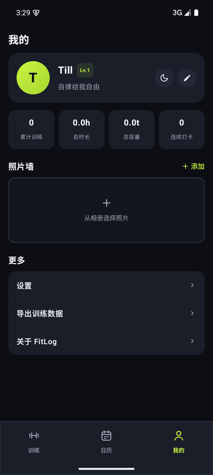

# FitLog

一个基于 **Kotlin + Jetpack Compose** 原生开发的 Android 健身记录应用。用于记录训练动作、制定训练计划、安排训练日历，并跟踪个人健身数据。

## 功能特性

- **训练记录**：快速开始一次训练，记录每个动作的组数、次数、重量，支持设定动作目标
- **训练日历**：按日历查看每日训练历史，快速回顾当天的训练安排与完成情况
- **训练计划**：创建并管理训练计划（如"推 / 拉 / 腿"），支持一键将计划加入训练
- **动作库**：内置 1300+ 训练动作并按身体部位 / 器械分类，带中文分步教学、缩略图与 **GIF 动图演示**、目标/次要肌群，支持创建自定义动作，查看动作历史详情
- **个人资料**：编辑个人身体数据（身高、体重、目标等），查看训练统计
- **设置**：深色 / 浅色主题切换、默认组间休息时长、声音与振动反馈
- **数据存储**：完全离线本地存储（Room 数据库 + DataStore），无需联网，隐私安全

## 界面预览（夜间模式）

| 首页 | 训练库 | 动作详情 | 训练清单 |
| --- | --- | --- | --- |
|  |  |  |  |

| 专注模式 | 组间休息 | 日历 | 我的 |
| --- | --- | --- | --- |
|  |  |  |  |

深空底 + 实心厚卡 + Volt 荧光绿强调；动作图示/动图素材不随仓库分发（见下方说明），
截图中为本地已启用媒体的效果。

## 技术栈

| 层面 | 技术 |
| --- | --- |
| 语言 | Kotlin 2.0 |
| UI | Jetpack Compose + Material 3 |
| 架构 | 单向数据流 + ViewModel + Repository |
| 数据库 | Room（KSP 生成） |
| 偏好存储 | DataStore Preferences |
| 图片加载 | Coil |
| 导航 | Navigation Compose |
| 最低系统 | Android 7.0（minSdk 26） |

## 环境要求

- **JDK 17+**（推荐 JDK 21，项目已在 `gradle.properties` 中配置）
- **Android Studio**（推荐最新稳定版，或 Koala+ 版本）
- **Android SDK**（compileSdk 35）
- Gradle 使用项目自带的 wrapper，无需单独安装

> 提示：`settings.gradle.kts` 中已配置国内阿里云 Maven 镜像，可加速依赖下载。

## 安装方式

### 方式一：克隆源码并用 Android Studio 运行

```bash
# 克隆仓库
git clone https://github.com/till-always/Fitlog.git
cd Fitlog
```

然后：

1. 用 **Android Studio** 打开克隆下来的 `Fitlog` 目录
2. 等待 Gradle 同步完成（首次会自动下载依赖）
3. 连接一部开启了 **USB 调试** 的 Android 手机，或用内置模拟器
4. 点击工具栏的 **Run ▶** 即可安装运行

### 方式二：命令行构建并安装 APK

```bash
# 生成调试版 APK（输出在 app/build/outputs/apk/debug/）
./gradlew assembleDebug

# 或直接安装到已连接的设备 / 模拟器
./gradlew installDebug
```

Windows 用户使用：

```powershell
gradlew.bat assembleDebug
gradlew.bat installDebug
```

安装完成后，在手机上找到 **FitLog** 图标并打开即可开始使用。

## 项目结构

```
FitLog/
├── app/
│   └── src/main/
│       ├── java/com/fitlog/app/
│       │   ├── data/            # 数据层：Room 数据库、DataStore、Repository
│       │   │   ├── db/          # 实体、DAO、数据库、种子数据
│       │   │   ├── model/       # 枚举等数据模型
│       │   │   ├── prefs/       # 设置存储
│       │   │   └── repo/        # 业务仓库
│       │   ├── ui/              # UI 层（Compose）
│       │   │   ├── nav/         # 导航
│       │   │   ├── home/        # 训练首页
│       │   │   ├── calendar/    # 日历
│       │   │   ├── training/    # 训练进行中
│       │   │   ├── library/     # 动作库
│       │   │   ├── plan/        # 训练计划
│       │   │   ├── summary/     # 训练总结
│       │   │   ├── profile/     # 个人资料与设置
│       │   │   ├── components/  # 通用组件
│       │   │   └── theme/       # 主题
│       │   └── util/            # 工具类
│       └── res/                 # 资源
├── build.gradle.kts             # 项目级构建配置
├── settings.gradle.kts          # 项目设置
└── gradle/                      # Gradle wrapper
```

## 许可证

本项目`license`未指定，如需用于商业用途请联系作者。

---

# FitLog

A native **Android fitness tracking app** built with **Kotlin + Jetpack Compose**. Record workouts, create training plans, schedule on a calendar, and track your personal fitness data.

## Features

- **Workout logging**: start a workout, log sets / reps / weight per exercise, set per-exercise targets
- **Training calendar**: view daily workout history and planned sessions on a calendar
- **Training plans**: create and manage plans (e.g. Push / Pull / Legs) and start them with one tap
- **Exercise library**: built-in exercises categorized by body part / equipment, create custom exercises, view per-exercise history
- **Profile & analytics**: edit body metrics, view training statistics
- **Settings**: dark / light theme, default rest duration, sound & vibration feedback
- **100% offline & private**: all data stored locally (Room + DataStore), no network required

## Tech Stack

- **Language**: Kotlin 2.0
- **UI**: Jetpack Compose + Material 3
- **Architecture**: Unidirectional data flow + ViewModel + Repository
- **Database**: Room (KSP)
- **Preferences**: DataStore Preferences
- **Imaging**: Coil
- **Navigation**: Navigation Compose
- **Min SDK**: 26 (Android 7.0)

## Requirements

- **JDK 17+** (JDK 21 recommended, configured in `gradle.properties`)
- **Android Studio** (latest stable recommended)
- **Android SDK** (compileSdk 35)
- Gradle wrapper included, no separate install needed

## Installation

### Option 1: Clone & run with Android Studio

```bash
git clone https://github.com/till-always/Fitlog.git
cd Fitlog
```

1. Open the `Fitlog` directory in **Android Studio**
2. Wait for the Gradle sync to finish
3. Connect a device with **USB debugging** enabled, or use the emulator
4. Press **Run ▶**

### Option 2: Build & install from the command line

```bash
./gradlew assembleDebug   # debug APK at app/build/outputs/apk/debug/
./gradlew installDebug    # install directly to a connected device
```

Windows users:

```powershell
gradlew.bat assembleDebug
gradlew.bat installDebug
```

## 动作库素材来源

动作库的动作数据（中文名称/分步教学/肌群/器械，MIT 许可）来自
[hasaneyldrm/exercises-dataset](https://github.com/hasaneyldrm/exercises-dataset)，
随仓库分发。

动作**图示与动图**版权归 **Gym visual** 所有 — https://gymvisual.com/ ，
**不随本仓库分发，也不提供获取渠道**。本地开发请自行准备已获授权的素材文件，
按 `ex/{动作id}.jpg`、`exg/{动作id}.gif` 放入 assets（id 见 `exercises.json`）；
缺失的动作用部位色徽章展示，功能不受影响。商用/分发前需获得 Gym visual
授权或使用自有素材，详见 `app/src/main/assets/dataset/NOTICE.md`。

## License

License not specified in this project. Please contact the author for commercial use.
